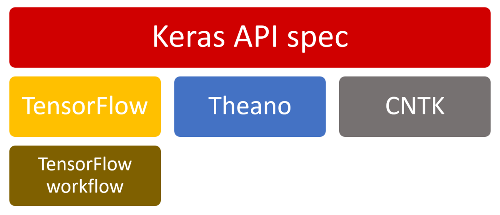
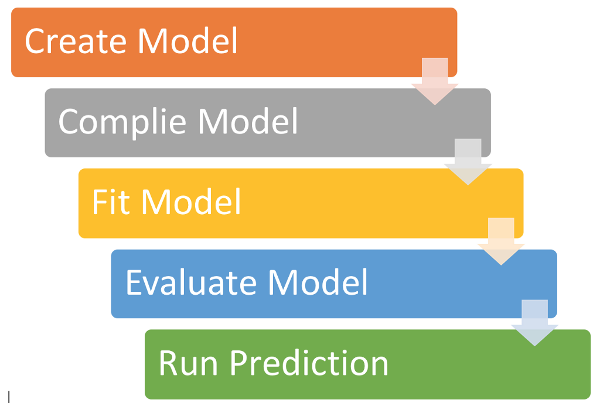

# Keras API

Keras is an open-source neural-network library written in Python. It was developed by Francois Chollet while he was at Google.
Keras is high Level API (Application Programmable Interface) that allow to build the Deep learning or Machine Learning models easily without detail understanding about internal architecture 
how the ML algorithm works internally.

It can run on top of TensofFlow, Microsoft Cognitive Toolkit, Theano and PlaidML. Keras has support for convolutional and recurrent neural networks.
Below picture illustrates how Keras API works. 

- [Main Page](README.md)
- [The Iris Dataset](iris-dataset.md)
