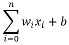

# The Perceptron

Artificial Neural Networks or ANN have a base in biology.
We are going to see how we can mimic biological neuron with an artificial neuron, which is also known as Perceptron.


In a biological neuron, there are dendrites that feed-in to the body of the cell, and the number of dendrites can be many sometimes. And through these dendrites, and electrical signal is passed to the body of the cell and as a result, a single output goes through Axon, while the Axon, would connect to another Neuron through Axon terminals. 
Similarly, we have artificial Neurons, as shown in the image below. 


As you can see, that we’ve three different inputs coming towards the artificial neuron, and there’s a single output being generated through it. So basically, we are mimicking biological neuron. This simple model is also called Perceptron. 

### The Input

Let’s talk about the input a little bit. The inputs are also called features. They can be any kind of information which is being passed towards the cell. 
Suppose in the example above, we’ve the following inputs:

```
-	Input-1 = 8
-	Input-2 = 6
-	Input-3 = -4
```
The next thing we are going to do is, to multiply these inputs from a weight. To following the same example, our equation will be like as follows:
```
-	Input-1 =   8   * weight-1
-	Input-2 =   2   * weight-2
-	Input-3 =   -4  * weight-3
```
Keep in mind that weights are basically initialized through random numbers, so the random number can be any number which is randomly generated. So, let us now replace the labels (weight-1, weight-2 and weight-3) from some random values (0.5, -1, 0), after doing that, the equation would look as follows:
```
-	Input-1 =   8   * 0.5
-	Input-2 =   2   * -1
-	Input-3 =   -4  * 0
```
So out result would come as follows:
```
-	Input-1 =   4
-	Input-2 =   -2
-	Input-3 =   0
```
The next step will be to take these results (the inputs) and pass them to the Activation Function. Which is actually the function that will be performed inside the cell body. We will discuss about different Activation Functions later, as there are many different kinds of activations functions available.
For time being, let us stick to the activation function as follows:

-	If the Sum of inputs = positive value, then return 1
-	If the Sum of inputs = negative value, then return 0

With the above activation function applied, we can easily calculate the sum of inputs as 
```
4 + (-2) + = 4 -2 +0 = 2
```

So out results would come out to be 1, as the sum of input is also 2 which is a positive value.

But, there’s a small glitch. Consider the case, where the original input became as Zero:

```
-	In-1 = 0 * weight-1
-	In-2 = 0 * weight-2
-	In-3 = 0 * weight-3
```

In the case shown above, no matter what the weight would be, but the result will always be zero, which means that in all cases, the output will always be zero. 

In order to over come this, we use a term called Bias, which will be added to the input with value as 1
Now the mathematical equation would be as follows: 

```

```
Which is that the value of “i” can be 0 to n
and weight of “i” is multiplied by value of “i” (which is x) plus the bias
Now, once we’ve many perceptron in a network, we will see how we can extend this to a matrix form. 

### Neural Networks

So far, we’ve understood how a single perceptron behaves, let’s take a look on a neural network by expanding this a
little bit more. Let’s see how the perceptrons network will look like in an image as well as how we can mathematically represent it.


As you can see in the above picture, it shows an input layer consisting of 3 perceptrons (3 is just for illustration, it can be N number of perceptrons) and there are two input layers, and there’s an output later. 

Hidden layers are those that don’t get to see the outside, as you can see, these are the layers between the input and output layers.

Note: If there are 3 or more hidden layers, that is called “deep network”

So what we got from the above image is as follows:

Input Layers: Real Values from the Data, or actual input from the outside. 
Hidden Layers: The layers between input layer and output layers, don’t get to see outside.
Output Layers: Final estimate of the output, or actual output to the outside. 

So, the more we move forward with these layers, the level of abstraction will be getting increased.

### Activation Function

I hope that you understood that we pass the input to the body of the cell, and in other words, there’s an activation function where the input is passed. We assumed a very simple activation function (which is called 0/1 step) which will either output 0 or 1, which was based on the sum of all inputs.

But there are various different kinds of Activation functions as illustrated below, along with their mathematical and graphical representations.

Let us discuss about the 0/1 step function for instance, suppose we’ve a weight value of 0.5 with the value of input as 8 so the equation would become as follows:

```
z = xw + b
z = 8 * 0.5 + 1 
z = 5
```
After putting the condition of the Activation function (any value greater than 0 is 1, and less than 0 is 0)
```
z = 5 => z=1
```
The letter “z” is just representing the output here. 
Now, suppose, that the weight is not 0.5 but it is 0.7, then what would happen? Although, there is a slightest difference in the input, but the output will still be 1 or 0.

But what if, we want to record that slightest level of change also and want the output to be not just 0 or 1 but say 1.1 or 2.6 etc. For that we’ve a Sigmoid function. Which represents the output in a more dynamic way as shown in the below figure. 

Similarly, we’ve a Hyperbolic Tangent function. And we also have ReLU (also known as Rectified Linear Unit) function. ReLU is relatively a simple function: max (0, z). also note ta ReLU function is considered start of the art and most widely used function. And also, ReLU tends to have the best performance of all functions. 

Below picture illustrates some different types of Activation functions.


We are going to discuss about all these function greater details once we actually start using our own Neural Networks. So, let us jump right into building our own Neural Network Model using Keras.

- [Main Page](README.md)
- [Keras](keras.md)


